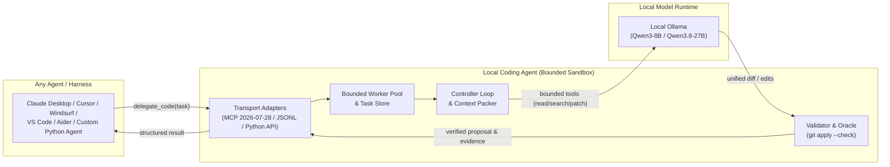

<div align="center">

# Local Coding Agent

**Harness-agnostic controller delegating atomic coding sub-tasks to local Ollama models with verified diffs and zero-risk sandboxing.**

[](https://github.com/pvnc228/local-coding-agent/actions/workflows/ci.yml)
[](https://www.python.org/downloads/)
[](https://modelcontextprotocol.io)
[](tests/)
[](LICENSE)

[Quickstart](docs/QUICKSTART.md) • [Architecture](docs/ARCHITECTURE.md) • [MCP Integration](docs/MCP_INTEGRATION.md) • [Benchmarks](docs/BENCHMARK.md) • [Protocol](docs/PROTOCOL.md)

</div>

---

## Overview

Frontier cloud models (Claude Opus 5, GPT-5.6 Sol, Gemini 3.7 Flash) are exceptional at high-level reasoning and architecture, but consuming expensive cloud API tokens on repetitive single-file refactoring, syntax fixes, and boilerplate generation is inefficient.

**Local Coding Agent** acts as an intelligent, bounded co-processor for any AI agent or harness. Your primary agent formulates an atomic task envelope, while the local controller orchestrates a quantized local model (such as `qwen3.8-27b-q4` or `qwen3-8b-q6k`) running via Ollama.



---

## Universal Harness & Agent Support

Local Coding Agent is completely agent- and harness-agnostic. It integrates across the entire landscape of modern AI coding environments:

1. **AI-Native IDEs (Cursor, Windsurf)**: Connects via MCP to Cursor's Composer mode and Windsurf's Flow/Cascade engine to offload single-file edits without burning cloud quotas.
2. **Terminal-Native Agents (Claude Code, Aider, Roo Code)**: Integrates directly with terminal harnesses and VS Code agents for automated sub-task delegation.
3. **OpenAI Codex & ChatGPT Integrations**: Interfaces with OpenAI Codex powered pipelines and GPT-5.6 agent loops.
4. **Model Context Protocol (MCP 2026-07-28 + Dual-Era)**: Compatible with Claude Desktop, Cursor, Windsurf, Roo Code, and any standard MCP host.
5. **Direct Python API (`DelegationService`)**: Embeds into custom Python agent frameworks, background task queues, and orchestrators as an in-process library.
6. **Process-Bound JSONL stdio (`StdioDelegationAdapter`)**: Connects to external CLI pipelines and non-Python tools via standard input/output streams.

---

## Core Invariants & Safety Guarantees

- **Zero-Risk Sandbox**: The local model is never given arbitrary shell or terminal access. It interacts strictly through bounded repository tools (`read_file`, `search_text`, `propose_patch`, and allowlisted `run_tests`).
- **Proposal-Only by Default**: Files on disk are never altered by the local model directly. The controller generates a structured unified diff and validates it with `git apply --check` before accepting.
- **Mediated Apply with Auto-Rollback**: Applying changes (`apply_proposal` or `--apply`) requires explicit confirmation with a SHA-256 preview digest. If post-apply tests fail, the workspace is automatically rolled back.
- **No False Self-Reporting**: Test execution evidence is owned exclusively by the external process runner. Model claims of test completion without runner proof are deterministically rejected.
- **Loop Protection**: Duplicate identical tool calls immediately break the loop to prevent infinite token consumption.

---

## Quickstart

### 🤖 1-Prompt Setup for Coding Agents

If you are using an AI coding assistant (**Claude Code**, **Cursor Composer**, **Windsurf Cascade**, **Roo Code**, or **OpenAI Codex**), simply give it this prompt:

```text
Install and configure https://github.com/pvnc228/local-coding-agent:
1. Run `pip install -e .[mcp]` (or `pip install local-coding-agent[mcp]`)
2. Run `python -m local_coding_agent doctor` to verify Ollama status
3. Run `python -m local_coding_agent init-mcp --auto --write` to register the MCP server
4. Run `python -m local_coding_agent test-run --mock` to verify sandbox execution
```

---

### Manual Setup

#### 1. Installation

Install via `pipx` or `pip`:

```bash
pipx install local-coding-agent[mcp]
```


### 2. Environment Diagnostics (`doctor`)

Check your local Ollama connection, system RAM/VRAM, and model catalog:

```bash
local-agent doctor
```

```text
============================================================
  Local Coding Agent — System Diagnostic Wizard
============================================================
[OK]   Python Runtime: Python 3.12.0
[OK]   Git Executable: git version 2.47.1
[OK]   Host Memory: RAM: 32 GB total (20 GB available)
[OK]   Ollama API: Connected to http://127.0.0.1:11434 (latency: 45ms, 4 models)

Installed vs Recommended Models:
  • qwen3-8b-q6k:latest (Installed)
  • qwen3.8-27b-q4:latest (Installed)
============================================================
  Overall Status: READY (All critical checks passed)
============================================================
```

### 3. Connect to Your Editor

Automatically register Local Coding Agent into your editor configuration:

```bash
# Auto-detect IDE in current workspace and system:
local-agent init-mcp --auto --write

# Or configure a specific editor:
local-agent init-mcp --cursor --write
local-agent init-mcp --claude --write
local-agent init-mcp --windsurf --write
local-agent init-mcp --vscode --write
```


### 4. Interactive Smoke Test (`test-run`)

Verify end-to-end task delegation and TPS in an isolated workspace:

```bash
local-agent test-run --profile qwen2.5-coder
```

---

## Benchmark & Model Performance

Evaluated against atomic coding benchmarks using deterministic external oracle verification and 95% Wilson confidence intervals:

| Model Profile | Quant / Format | Context Window | Eval TPS | Patch Validity | VRAM Requirement | Recommended Use Case |
| :--- | :--- | :--- | :---: | :---: | :---: | :--- |
| **`qwen3-8b-q6k`** | Q6_K GGUF | 8,192 tok | **~85-110 tok/s** | **100%** | ~8-12 GB | Daily coding workhorse, fast refactors |
| **`qwen3.8-27b-q4`** | Q4_K_M GGUF | 8,192 tok | **~45-65 tok/s** | **100%** | ~16-24 GB | Complex logic & multi-file changes |
| **`qwen2.5-coder`** | 7B / 14B Q4 | 8,192 tok | **~75 tok/s** | **95%** | ~6-10 GB | General code completions |
| **`bonsai-64k`** | Custom 64k | 65,536 tok | **~60 tok/s** | **92%** | ~12-16 GB | Large context reading |

> Full evaluation methodology and logs: [docs/BENCHMARK.md](docs/BENCHMARK.md)

---

## Real-Time Monitoring & Web Dashboard

Launch the built-in HTTP metrics server to inspect active worker pool load, queue latency, and live tokens per second:

```bash
local-agent monitor --port 8765
```

Open `http://127.0.0.1:8765/dashboard` for live updates.

---

## CLI Commands Reference

| Command | Description |
| :--- | :--- |
| `local-agent doctor` | Automated diagnostics for Ollama API, Git CLI, RAM/VRAM, and model catalog. |
| `local-agent init-mcp` | Generate & merge MCP configs for Claude Desktop, Cursor, Windsurf, VS Code. |
| `local-agent test-run` | Run self-contained atomic smoke tests with live TPS and diff validation. |
| `local-agent serve-mcp` | Start the official-SDK MCP stdio server with Tasks extension support. |
| `local-agent monitor` | Start the lightweight stdlib HTTP observability server & HTML dashboard. |
| `local-agent benchmark` | Execute the reproducible proposal-only benchmark suite. |

---

## Documentation

- **[docs/QUICKSTART.md](docs/QUICKSTART.md)** — 60-second quickstart guide.
- **[docs/ARCHITECTURE.md](docs/ARCHITECTURE.md)** — Controller architecture, worker pool, and task storage.
- **[docs/MCP_INTEGRATION.md](docs/MCP_INTEGRATION.md)** — Model Context Protocol (MCP 2026-07-28) integration guide.
- **[docs/PROTOCOL.md](docs/PROTOCOL.md)** — Detailed communication protocol and SEARCH/REPLACE specifications.
- **[docs/BENCHMARK.md](docs/BENCHMARK.md)** — Benchmarking methodology, TPS measurements, and model evaluation.

---

## License & Contributing

Distributed under the **MIT License**. See [LICENSE](LICENSE) for details.
Contributions are welcome! Please read [CONTRIBUTING.md](CONTRIBUTING.md) and [SECURITY.md](SECURITY.md) before submitting Pull Requests.
