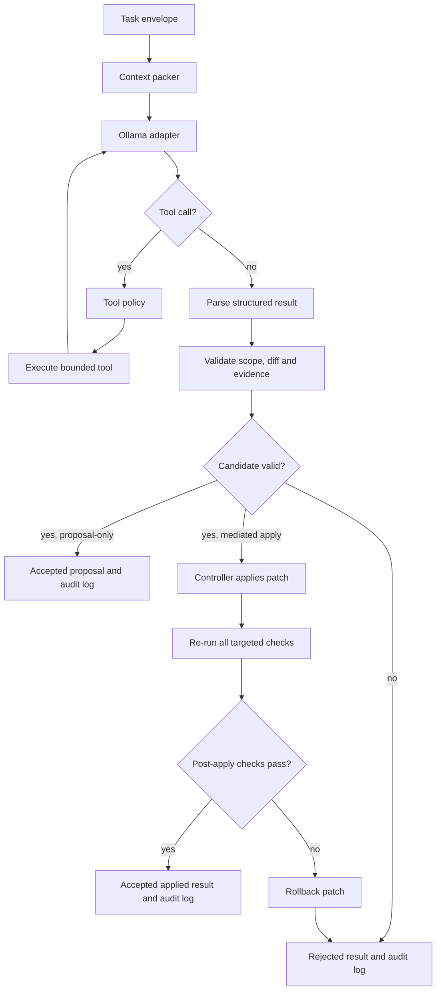

# Architecture

## System Components

### Controller
The core orchestration layer. It selects the model profile, packs minimal context, provides bounded tools, enforces execution policies, and validates results against deterministic oracles.

### Direct Service Seam
`DelegationService` is the transport-neutral API entry point for trusted host processes. It validates that the requested `workspace_ref` is pre-registered and that the requested `model_profile` exists in the configuration allowlist. It performs bounded `TaskBudget` preflight validation and runs the `Controller` loop strictly in proposal-only mode. The `request_id` is reserved atomically per caller/workspace pair to prevent duplicate concurrent executions, while an in-memory LRU cache stores terminal results.

### Process-Bound stdio Adapter
`StdioDelegationAdapter` provides a lightweight UTF-8 JSONL process boundary exposing the single `delegate_code` operation. It decodes bounded JSONL lines, converts them into `DelegationRequest` instances, and forwards them to `DelegationService`. It does not own workspace registry, model allowlist, or direct file operations.

### Bounded Worker Pool & Task Store
`BoundedWorkerPool` provides a concurrency-limited execution layer over `DelegationService`. It bounds active worker slots and queued jobs, preserves caller-scoped idempotency, isolates requests/results between workers, and propagates cooperative cancellation to the controller. `JsonFileTaskStore` provides persistent on-disk storage for task records and recovers interrupted tasks upon restart. A `SharedExecutionGate` synchronizes MCP tasks, legacy MCP calls, and mediated apply requests to ensure strict concurrency limits.

### Observability & HTTP Monitor
`MonitorServer` is a lightweight stdlib HTTP server providing real-time JSON metrics (`/health`, `/stats`, `/tasks`) and an interactive HTML web dashboard (`/dashboard`) to monitor active worker load, queue latencies, live TPS, and patch audit logs.

### Developer Experience & Setup Wizard
CLI subcommands:
- `local-agent doctor`: Automated diagnostics for Ollama API connectivity, Git availability, system RAM/VRAM, and model catalog.
- `local-agent init-mcp`: Multi-client configuration generator and merger supporting Claude (Desktop & Code), ChatGPT (Desktop & Codex), Google Antigravity (Desktop & agy), OpenCode (Desktop & CLI), Cline (Desktop & CLI), Cursor, and Windsurf.

- `local-agent test-run`: Isolated end-to-end smoke test verifying task delegation, patch generation, TPS calculation, and diff application.

### Local Model Executor
The local Ollama runtime. It ingests the bounded task context, executes reasoning loops, and returns structured edit proposals or tool calls.

### Repository Tools
Narrow operations with explicit security boundaries:
- `list_files`: Restricted strictly to allowlisted workspace paths.
- `read_file`: Restricted to allowlisted files with bounded byte limits.
- `search_text`: Bounded pattern and literal text search within allowlisted files.
- `propose_patch`: Propose code changes without writing to disk, either as unified diffs or SEARCH/REPLACE blocks (`edits`).
- `apply_patch`: Controller-only operation. Never exposed directly to the model; only executed during mediated apply after full validation.
- `run_tests`: Restricted to pre-allowlisted verification commands in isolated child processes.

---

## Execution Flow



---

## Task Lifecycle States

```text
received
  -> context_ready
  -> awaiting_model
  -> tool_call
  -> awaiting_tool_result
  -> candidate_ready
  -> validating
  -> checking
  -> accepted | rejected | needs_context | failed
```

---

## Security Boundaries & Invariants

- File access is strictly bounded by the task allowlist.
- Absolute paths outside the workspace boundary are rejected or normalized.
- Tool result sizes are strictly capped (`max_tool_result_bytes`).
- Test commands are taken exclusively from the pre-configured task definition, never from model text.
- `run_tests` continuously drains stdout/stderr via bounded collectors so child processes cannot block on full pipes.
- Process trees are terminated with bounded timeouts.
- `apply_patch` is a controller-only internal seam. The local model cannot directly write to disk.
- Proposal-only is the default execution mode. Disk writes require explicit mediated apply (`apply_proposal` or `--apply`).
- When applying changes, allowlisted targeted checks are re-run post-apply; `applied: true` is only returned if all checks pass, otherwise changes are immediately rolled back.
- Non-empty patch proposals are rejected if no targeted check is configured.
- `audit`, `validation`, and `applied` status fields are owned strictly by the controller.
- Test execution evidence belongs exclusively to the external process runner.
- Duplicate identical tool calls immediately break the loop to prevent infinite execution.
- Tasks exceeding `max_turns` are terminated and marked incomplete.

---

## Model Profile Configuration

Model profiles are defined as declarative configurations:

```yaml
name: qwen3-8b-q6k
provider: ollama
model: qwen3-8b-q6k:latest
endpoint: http://127.0.0.1:11434
think: false
temperature: 0.7
top_p: 0.8
presence_penalty: 1.5
num_ctx: 8192
num_predict: 512
keep_alive: 10m
max_context_length: 262144
```

---

## VRAM & Context Management

Ollama's `/api/ps` endpoint is used as the source of truth for active models and allocated VRAM (`size_vram`). `ModelMemoryManager` captures snapshots, unloads idle models, and evicts unprotected models to maintain memory budgets. Protected models can be specified via a `keep` allowlist.

`ModelProfile.num_ctx` sets the context window for requests, while `max_context_length` enforces hardware and model limits.

---

## Pinpointed Prescriptions Engine (v0.4.0)

Small local models (2B–4B) lack the deductive capacity to interpret generic error messages like "invalid JSON" or "validation rejected". The `local_coding_agent.prescriptions` engine provides deterministic, rule-based diagnostic translation that turns validator failures into laser-focused, unambiguous instructions:
- **Schema Corrections**: Explicit directives for `checks: []` empty arrays and `risks: []` list types.
- **SEARCH/REPLACE Diagnostics**: Actionable hints on whitespace indentation (`read_file`), line-alignment, and multi-match ambiguity.
- **Tool Protocol Enforcement**: Automatic guidance on mutually exclusive fields (`edits` vs `patch`) and allowlist boundaries.
- **Zero Distillation Guarantee**: Prescriptions are generated strictly by deterministic Python rules without leaking host LLM reasoning.

---

## CLI-First Principle & Agent-Agnostic Architecture

To ensure the controller is usable by any AI agent ecosystem (Claude Code, Cursor, Windsurf, Roo Code, ChatGPT Codex, Antigravity, OpenCode) as well as terminal scripts and human developers, the architecture strictly enforces the **CLI-First Invariant**:

1. **100% Feature Parity**: Every capability offered over MCP or internal Python APIs has a direct CLI subcommand counterpart (`delegate`, `decompose`, `profiles`, `memory`, `calibrate`, `benchmark`, `apply`, `init-skill`, `doctor`, `init-mcp`, `test-run`, `serve-mcp`, `monitor`).
2. **Machine-Parseable JSON**: All subcommands support `--json` output with deterministic schemas and standard POSIX exit codes (0 for success, 1 for rejected/failure, 2 for input error).
3. **Dedicated Agent Skill**: A structured, self-contained Agent Skill (`skills/local-coding-agent/SKILL.md`) is maintained in the repository and exportable across IDEs via `local-agent init-skill --write`.
4. **Future-Proofing Rule**: No new feature or tool may be added to the controller without a corresponding CLI subcommand and automated test coverage.


