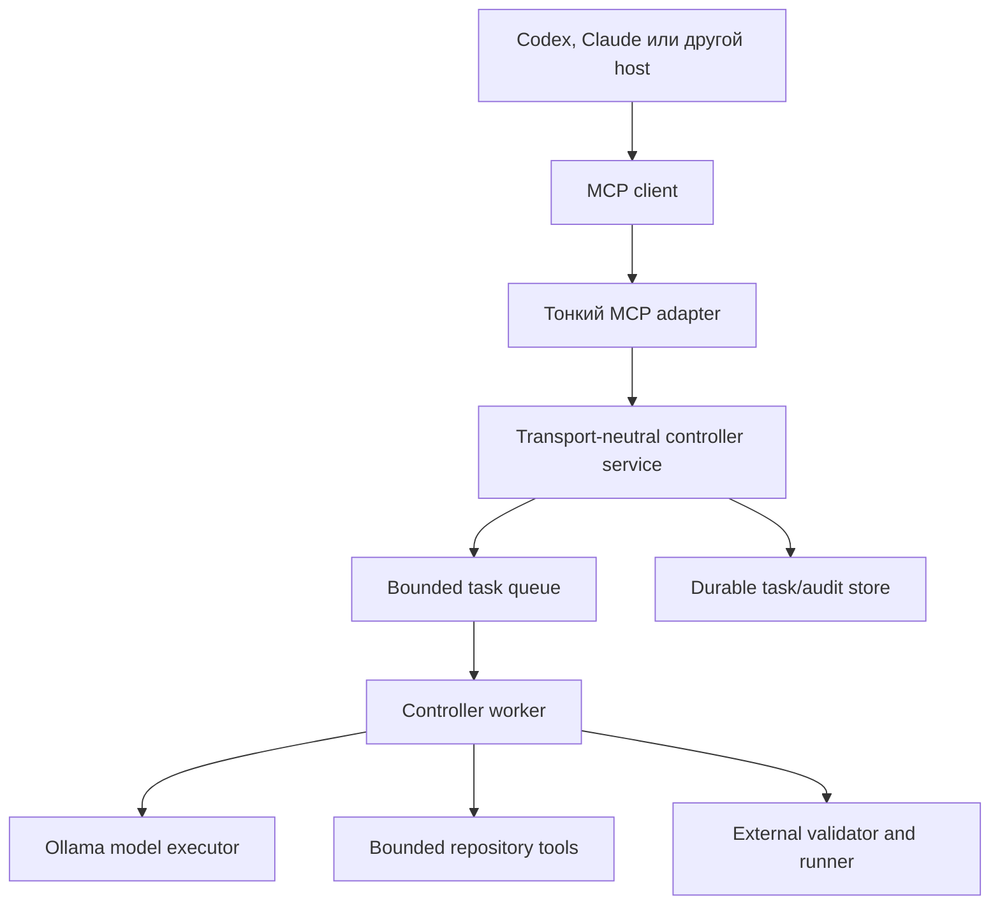

# MCP-адаптер для локального coding controller

Дата фиксации: 2026-08-13.

Статус: R5.1 transport-neutral core seam и первый process-bound JSONL stdio slice R5.2 реализованы в `local_coding_agent.service` и `local_coding_agent.stdio`. Это ещё не утверждение MCP conformance: pinned SDK, modern/legacy negotiation, Tasks и настоящий MCP client требуют отдельных gates.

## Решение

MCP добавляется как тонкий transport adapter поверх harness-agnostic controller core. Он не владеет repository policy, validation, audit, retry или применением patch и не даёт локальной модели новых полномочий.

Первый transport — direct local `stdio`. Первая публичная операция — proposal-only делегирование одной bounded coding-задачи. Длительная работа использует официальное MCP Tasks extension, только когда client явно заявил поддержку. Mediated apply не входит в первый MCP slice.

## Почему архитектуру нужно обновить

[MCP `2026-07-28`](https://blog.modelcontextprotocol.io/posts/2026-07-28/) — breaking revision стандарта:

- убраны `initialize`/`initialized` и `Mcp-Session-Id`;
- каждый запрос сам описывает protocol version, client identity и capabilities через `_meta`;
- добавлен необязательный `server/discover`;
- длительные операции вынесены в расширение `io.modelcontextprotocol/tasks`;
- запрос дополнительного ввода/подтверждения работает через Multi Round-Trip Requests;
- HTTP routing использует `Mcp-Method` и `Mcp-Name` с проверкой согласованности заголовков и body;
- list results получили `ttlMs`/`cacheScope`;
- Roots, Sampling, Logging и legacy HTTP+SSE deprecated;
- OAuth hardening требует issuer validation и перехода от DCR к Client ID Metadata Documents.

Это уже открытый community standard, а не Anthropic-specific API. Проект не должен связывать core с особенностями одного Claude/Codex host.

## Архитектурная граница



Инварианты:

- MCP adapter переводит wire request в core request и обратно;
- controller остаётся единственным владельцем policy, validation и controller-owned result fields;
- очередь, task state и audit принадлежат приложению, а не transport session;
- Ollama не знает о MCP и не получает credentials host;
- внешний дорогой агент остаётся владельцем постановки задачи, review и решения об escalation/apply.

## Transport-neutral contract сначала

До MCP нужно зафиксировать обычный Python/service contract поверх существующего `TaskEnvelope`.

R5.1 закрывает этот первый срез: `DelegationRequest` и `DelegationService` находятся в `local_coding_agent.service`. Service принимает только зарегистрированный `workspace_ref`, выбирает профиль через встроенный allowlist, использует caller-scoped bounded idempotency и всегда работает proposal-only. Apply и transport-specific lifecycle в этот срез не входят.

Предлагаемый request:

```json
{
  "request_id": "opaque-idempotency-key",
  "workspace_ref": "registered-workspace-handle",
  "task": {
    "id": "unique-preserve-order",
    "goal": "сохранить порядок первого появления",
    "files": ["src/unique.py"],
    "context": "минимальный контекст",
    "constraints": ["не менять публичную сигнатуру"],
    "checks": ["py -m unittest tests.test_unique -v"],
    "acceptance": ["targeted check passed"]
  },
  "model_profile": "qwen3-coder-q4"
}
```

Правила:

- `workspace_ref` создаётся host/configuration и разрешается server-side; произвольный абсолютный путь не принимается;
- `model_profile` берётся из allowlist, а не содержит произвольный endpoint или Modelfile;
- checks проходят существующую allowlist policy; это не shell callback;
- один `request_id` идемпотентен в пределах caller/workspace;
- adapter не принимает model-generated `audit`, `validation`, `applied` или status как доверенные поля.

Core result сохраняет controller-owned семантику:

```json
{
  "status": "accepted",
  "summary": "...",
  "patch": "...",
  "checks": [],
  "risks": [],
  "validation": {},
  "audit": [],
  "applied": false
}
```

В R5.1 `DelegationService` возвращает тот же result shape, что и `Controller`, нормализуя `applied: false`; durable `proposal_id` появится только вместе с proposal store/R5.3-R5.4. `attempt_budget` исключён из R5.1 до реализации R8: нельзя принимать параметр с обещанной retry semantics без соответствующего controller contract.

Transport lifecycle и controller result не смешиваются. MCP Task может иметь status `working`, а завершённый core result — `rejected`; это два разных уровня состояния.

## Минимальная MCP surface

### Современный client с Tasks

Публичный tool:

```text
delegate_code
```

Он всегда proposal-only. Если работа короткая, server может вернуть обычный tool result. Если работа долгая или поставлена в очередь, server возвращает `CreateTaskResult` с `resultType: "task"`.

[Tasks extension](https://modelcontextprotocol.io/extensions/tasks/overview) задаёт lifecycle:

- client объявляет `io.modelcontextprotocol/tasks` в per-request capabilities;
- server проверяет capability до возврата task handle;
- task durable-создан до ответа;
- client использует `tasks/get`, `tasks/update` и `tasks/cancel`;
- `input_required` переносит явное подтверждение или недостающий ввод;
- terminal states: `completed`, `failed`, `cancelled`;
- cancellation cooperative и подтверждает намерение, а не гарантирует мгновенную остановку.

`tasks/list` не добавляется: новая extension намеренно убрала его из-за небезопасного sessionless scoping.

### Legacy client

Поддержка host-ов, которые ещё говорят на revision 2025, должна быть compatibility layer, а не частью core:

- короткий `delegate_code` может блокироваться только до bounded timeout;
- для длинной операции fallback может вернуть opaque job handle и отдельные compatibility tools `get_delegation`/`cancel_delegation`;
- эти tools регистрируются только в legacy режиме, чтобы не раздувать modern schema;
- конкретный fallback выбирается после compatibility matrix реальных Codex/Claude clients.

Официальные SDK поддерживают 2026 revision, но host support varies. В TypeScript SDK v2 новый wire protocol требует явного opt-in/version negotiation; само обновление package не переводит старый server автоматически. Проект должен pin SDK version и иметь modern/legacy contract tests.

## Состояние без protocol sessions

Новый stateless wire не означает stateless application.

Сервер хранит:

- криптографически случайный `task_id`;
- caller identity/transport principal;
- `workspace_ref`;
- task envelope и model profile;
- queue/worker state;
- attempt history;
- audit и external evidence;
- terminal result и TTL.

Task handle:

- не является аутентификацией;
- привязывается server-side к caller identity;
- не должен быть последовательным или угадываемым;
- имеет TTL и terminal immutability;
- не позволяет получить чужой task через перебор ID.

Для local `stdio` caller boundary задаётся одним прямым client process и конфигурацией запуска. Для будущего HTTP identity берётся только из проверенного token, а не из аргумента tool.

## Confirmation и mediated apply

В первом MCP slice apply отсутствует. `delegate_code` возвращает только proposal.

Будущее применение — отдельная операция:

```text
apply_proposal(proposal_id)
```

Она допустима только после следующих условий:

1. proposal уже сохранён и связан с конкретным workspace/task;
2. host показал diff пользователю или авторизованному reviewer;
3. получено явное подтверждение через MRTR/`input_required` либо эквивалентный host UI;
4. controller повторно валидировал patch против текущего workspace;
5. после apply выполнены allowlisted checks;
6. при failure controller выполнил rollback и вернул внешнее evidence.

Нельзя добавлять `apply: true` в исходный `delegate_code`: это смешивает постановку задачи с отдельным destructive decision и позволяет модели/host случайно обойти confirmation boundary.

## Retries и escalation

MCP server не вызывает платную внешнюю модель через deprecated Sampling и не хранит provider credentials.

После исчерпания локального retry budget core возвращает `needs_host`/escalation bundle:

- исходный task envelope;
- просмотренные файлы и bounded context digest;
- использованный model profile;
- попытки и machine-readable причины;
- последние patch/validation issues;
- external evidence;
- risks и подтверждённый факт `applied: false`.

Host сам решает:

- уточнить envelope;
- выбрать другую локальную модель;
- декомпозировать задачу;
- написать исправление дорогой моделью;
- остановиться.

Escalation не является автоматическим API callback из controller core.

## Worker pool и backpressure

Один Ollama runtime может обслуживать несколько логических кодеров, но MCP не должен обещать физическую параллельность, которой нет.

Минимальные ограничения:

- `max_workers` и `max_queue` заданы конфигурацией;
- overload возвращает bounded rejection/retry hint;
- один task не делит messages, tool history, workspace или audit с другим;
- scheduler учитывает model residency и VRAM policy;
- queued и running tasks отменяются отдельно;
- repeated tool call останавливает текущую controller attempt независимо от общего retry budget;
- fairness не позволяет одному task бесконечно удерживать модель.

MCP Task создаётся только после успешной durable reservation. Нельзя вернуть handle, а затем потерять работу между response и записью в store.

## Transport и security

### Local MVP

- direct `stdio`, не localhost HTTP;
- server запускается точной командой из явной конфигурации host;
- workspace roots заранее разрешены;
- filesystem/network/process permissions минимальны;
- repository tools сохраняют существующий sandbox и allowlists;
- server не открывает произвольные URLs и не запускает команды из tool descriptions.

[MCP Security Best Practices](https://modelcontextprotocol.io/docs/2026-07-28/tutorials/security/security_best_practices) рекомендуют `stdio` для ограничения доступа локальным client и sandbox/minimum privileges для server process.

### Remote HTTP — только после local MVP

- revision `2026-07-28` с обязательными `Mcp-Method`/`Mcp-Name`;
- header/body consistency validation;
- HTTPS;
- OAuth с issuer и audience validation;
- CIMD вместо новой зависимости от deprecated DCR;
- никакого token passthrough в Ollama или downstream APIs;
- task handles привязаны к verified principal;
- rate limits, schema depth/validation time limits и audit correlation IDs;
- external `$ref` в schemas не dereference автоматически.

## Tool schema

`delegate_code` должен использовать JSON Schema 2020-12, но оставаться компактным. Большой schema ухудшит tool selection локальных моделей и увеличит prompt.

Рекомендуемые ограничения:

- закрытые объекты (`additionalProperties: false`) там, где это совместимо с host;
- лимиты строк, массивов и общего request size до запуска controller;
- deterministic order для tools/list;
- cache hints для стабильного каталога;
- никаких свободных `command`, `endpoint`, `path` или `credentials`;
- machine-readable error kinds совпадают между direct и MCP adapters.

## Порядок реализации R5

### R5.1 — Core service seam

Статус: реализовано локально, без MCP transport.

- `DelegationRequest` и `DelegationService` дают transport-neutral Python API;
- `workspace_ref` разрешается только из host-registered registry, произвольный путь не является полем запроса;
- `model_profile` берётся только из `profiles.py`; endpoint/Modelfile не передаются;
- caller-scoped `(caller_id, workspace_ref, request_id)` атомарно резервируется, поэтому параллельный одинаковый вызов ждёт тот же result, а другая нагрузка с тем же ключом получает `idempotency_conflict`; in-memory cache bounded;
- direct adapter всегда proposal-only и не имеет параметра `apply`;
- contract tests покрывают registry/profile policy, idempotency и controller-owned result fields.

Ограничение среза: `attempt_budget` пока не входит в `DelegationRequest`, потому что семантические retries/escalation принадлежат R8. Durable idempotency, reconnect и MCP-specific lifecycle остаются последующими этапами.

### R5.2 — Local stdio MCP, proposal-only

Статус: первый process-bound JSONL slice реализован; MCP conformance не заявлена.

- `StdioDelegationAdapter` принимает только UTF-8 JSONL `delegate_code` с bounded request size;
- request преобразуется в тот же `DelegationRequest`, а result возвращается из того же `DelegationService`;
- contract test сравнивает direct adapter с настоящим дочерним process и проверяет UTF-8, unknown method и oversized request;
- apply, произвольные paths/commands/endpoints и credentials не добавлены.

- официальный Tier 1 Python SDK, pinned version — deferred;
- один `delegate_code` tool;
- modern `2026-07-28` и проверенный legacy negotiation/fallback — deferred;
- никаких apply, remote auth или paid-model callbacks;
- integration test через настоящий MCP client process — deferred; текущий gate использует process-bound adapter.

### R5.3 — Tasks + worker queue

- durable task store;
- `io.modelcontextprotocol/tasks` capability negotiation;
- get/update/cancel lifecycle;
- bounded worker/queue/backpressure;
- crash/reconnect/cancellation evidence.

### R5.4 — Explicit apply

- отдельный `apply_proposal`;
- MRTR confirmation там, где host поддерживает;
- host UI fallback;
- stale-workspace revalidation, post-apply checks и rollback.

### R5.5 — Remote HTTP

Только после threat model, authorization tests и необходимости реального удалённого использования.

## Acceptance criteria

- одинаковая fixture проходит через direct adapter и MCP adapter с одинаковым core result;
- MCP adapter не может расширить files/checks/model profile;
- model result не подменяет `status`, `audit`, `validation` или `applied`;
- modern client получает Task только после explicit capability opt-in;
- legacy client не получает неизвестный polymorphic result;
- task ID переживает reconnect и остаётся caller-bound;
- cancellation и overload имеют bounded runtime evidence;
- MCP отключается без изменения controller core;
- ни один новый путь не даёт локальной модели произвольный shell, apply или paid-model callback.

## Не входит в первый slice

- MCP Apps/UI;
- remote HTTP и OAuth;
- model selection локальной моделью;
- произвольные workspace paths;
- автоматический apply;
- `tasks/list`;
- deprecated Roots/Sampling/Logging;
- автоматический commit/push;
- постоянная память модели.

## Источники

- [MCP 2026-07-28 release](https://blog.modelcontextprotocol.io/posts/2026-07-28/)
- [Stateless MCP, SEP-2575](https://modelcontextprotocol.io/seps/2575-stateless-mcp)
- [MCP Tasks extension](https://modelcontextprotocol.io/extensions/tasks/overview)
- [MCP Security Best Practices](https://modelcontextprotocol.io/docs/2026-07-28/tutorials/security/security_best_practices)
- [TypeScript SDK migration: protocol revision 2026-07-28](https://ts.sdk.modelcontextprotocol.io/v2/migration/support-2026-07-28)
