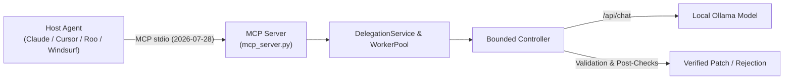

# MCP Integration Guide

Local Coding Agent features a compliant **Model Context Protocol (MCP)** server built on `mcp==2.0.0` (2026-07-28 stateless era + dual-era compatibility loop).

---

## Architecture Overview



---

## Available MCP Tools

### 1. `delegate_code`
Delegates an atomic, bounded coding sub-task to the local model.

**Input Parameters:**
- `goal` (*string*, required): One-sentence description of the goal.
- `files` (*array of strings*, required): Bounded list of allowlisted file paths.
- `context` (*string*, optional): Background context and snippets.
- `constraints` (*array of strings*, optional): Specific boundaries (e.g. "Do not change public API").
- `checks` (*array of strings*, optional): Explicit validation commands (e.g. `npm test -- unique`).
- `acceptance` (*array of strings*, optional): Acceptance criteria.

**Response:**
Returns a structured JSON result:
- `status`: `"accepted"`, `"rejected"`, `"needs_context"`, or `"failed"`.
- `summary`: High-level explanation of changes.
- `patch`: Standard unified diff proposal.
- `checks`: External runner evidence and exit codes.
- `risks`: Identified validation warnings.
- `audit`: Chronological event trail.

---

### 2. `apply_proposal`
Explicitly applies an accepted proposal to the local disk workspace.

**Input Parameters:**
- `request_id` (*string*, required): Unique ID of the previously accepted delegation.
- `workspace_ref` (*string*, optional): Registered workspace alias (default: `"workspace"`).

**Safety & Verification:**
- Requires user/client elicitation confirmation with SHA-256 preview digest.
- Automatically executes pre-apply applicability validation (`git apply --check`).
- Re-runs all allowlisted `task.checks` against the modified workspace.
- **Rollback Guarantee**: Automatically reverts changes if post-apply checks fail.

---

## Tasks Extension (`io.modelcontextprotocol/tasks`)

When the MCP client announces the `io.modelcontextprotocol/tasks` capability:
1. `tools/call` for `delegate_code` returns immediately with a `resultType: "task"` envelope.
2. Background task execution is handled by the `BoundedWorkerPool` and persisted in `TaskStore`.
3. The client polls progress via `tasks/get` until reaching `status: "completed"`.
4. Client cancellation triggers cooperative cancellation in the local model runner via `tasks/cancel`.

---

## Configuration Snippets

### Claude Desktop (`claude_desktop_config.json`)
```json
{
  "mcpServers": {
    "local-coding-agent": {
      "command": "local-agent",
      "args": [
        "serve-mcp",
        "--workspace", "/path/to/project",
        "--profile", "qwen3-8b-q6k",
        "--enable-tasks"
      ]
    }
  }
}
```

### Cursor (`.cursor/mcp.json`)
```json
{
  "mcpServers": {
    "local-coding-agent": {
      "command": "local-agent",
      "args": [
        "serve-mcp",
        "--workspace", "${workspaceFolder}",
        "--profile", "qwen3-8b-q6k"
      ]
    }
  }
}
```
